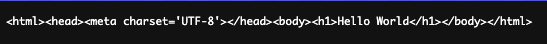

# Minimum reproduction for [honojs/hono#3736](https://github.com/honojs/hono/issues/3736)

> [!NOTE]
> This reproduction is based on hono 4.7.7

## How to reproduction

1. Clone this repository
2. `pnpm install`
3. `pnpm dev`
4. `curl --head http://localhost:3000`
5. You will see: `content-type: text/plain;charset=UTF-8`
    - This behavior is unexpected.
    - `content-type` should be `content-type: text/html; charset=UTF-8` since we set the header in `src/index.ts:22`
6. Then open your browser.
7. On the first access, you will see text of HTML.
    - 
8. And after reloading your browser once, you will see a HTML.

## Cause of the issue

This bug occurs in implementations that meet the following two conditions:

  1. Run `c.header(FOO,BAR,{append:true})` and then run `c.header` to set the `Content-Type` header.
  2. Access `Context.res` getter before `Context.#newResponse` is called.

## Detailed Description

This section explains the cause of the problem in detail, following the flow of the reproduced implementation of `src/index.ts`.

Calling `c.header()` with `append: true` at `src/index.ts:11` initialize `Context.#headers` and destroys `Context.#prepareHeaders`.
ref: <https://github.com/honojs/hono/blob/5ca6c6ef867e022671b4c429c04d0ff89ed0c37c/src/context.ts#L531-L545>

> [!NOTE]
> All subsequent `c.header()` calls will mutate `Context.#headers`.
> ref: <https://github.com/honojs/hono/blob/5ca6c6ef867e022671b4c429c04d0ff89ed0c37c/src/context.ts#L531-L545>

---

The author's implementation of this issue used CORS Middleware before the route handler, which calls `Context.res.headers.set()` before calling `await next()`.
ref: <https://github.com/honojs/hono/blob/5ca6c6ef867e022671b4c429c04d0ff89ed0c37c/src/middleware/cors/index.ts#L83-L91>

This initializes `Context.#res` with `new Response(‘404 Not Found’, { status: 404 })`.
ref: <https://github.com/honojs/hono/blob/5ca6c6ef867e022671b4c429c04d0ff89ed0c37c/src/context.ts#L398-L405>

In this case, `Context.#res.headers` contains `content-type: text/plain;charset=UTF-8`.

---

And Setting the `Content-Type` header in `src/index.ts:22`, the value will be recorded in `Context.#headers` for the reasons just described.

---

Then, by calling `c.body()` in `src/index.ts:23`, `Context.#newResponse` is executed.

This branch will be executed because `Context.#res` has been initialized by CORS Middleware.
<https://github.com/honojs/hono/blob/5ca6c6ef867e022671b4c429c04d0ff89ed0c37c/src/context.ts#L669-L678>

In this branch, `content-type:text/html; charset=UTF-8` set in `Context.#headers` is overridden by `content-type: text/plain;charset= UTF-8` from `Context.#res.headers`.

If `Context.#preparedHeaders` contains `content-type:text/html; charset=UTF-8`, then `content-type` in `Context.#headers` is overwritten at the end of the branch, and the response header will contain `content-type:text/html; charset=UTF-8` as expected.

However, this is not the case because we called `c.header()` with `append: true` at `src/index.ts:11`.

---

This behavior results in unexpected `content-type: text/plain;charset=UTF-8`.
